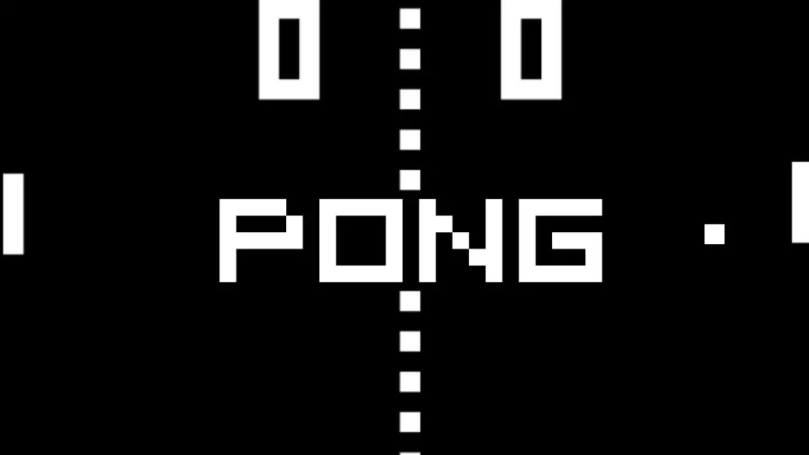

<!-- # Hi, my name is Vitor Odorico. -->
> I'm a software development student, always looking to evolve.
In this project, I developed a very famous application. that marked the childhood of the 1980s.

## Pong
### A little of his history
> Pong is a table tennis-themed arcade sports game with two-dimensional graphics developed by Atari and originally released in 1972s.

<h2> Tecnolies used</h2>

 

  
  

<h2> Ide used</h2>

  

<h2>Visual Editing</h2>

>  Alura's course decided to continue with Sketch to see the evolutions while the project is implemented
